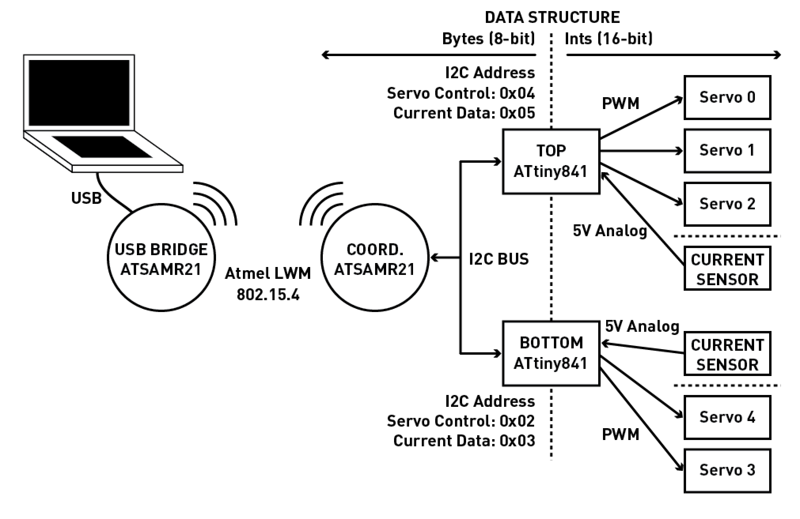
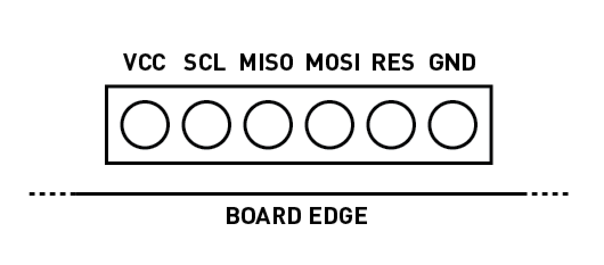
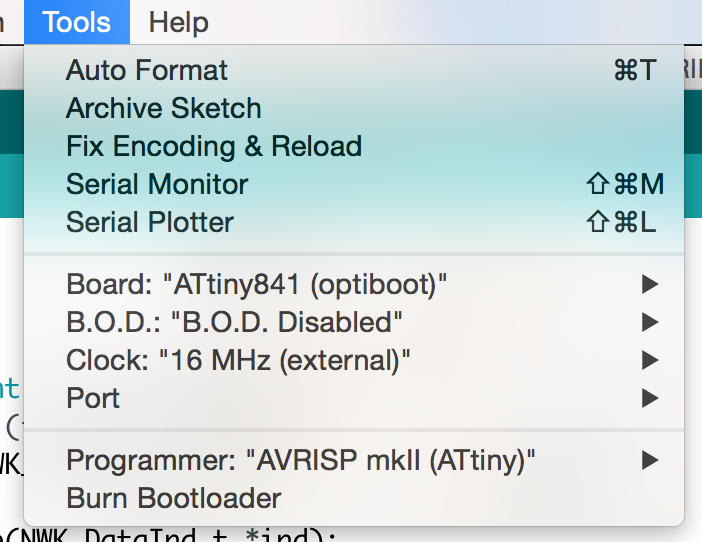

# Software 

This document describes the embedded programming of MiniMOJO. This includes:

   1. Burning the bootloaders
   1. Uploading the embedded code
   1. Navigating the local microcontroller network

## Overview

The electrical system for MiniMOJO consists of three microcontrollers: one ATSAMR21 coordinator that communicates wirelessly with either other MiniMOJO coordinators or the USB bridge, and two ATtiny841 controllers that control the servos and read the present DC current consumption. 

## Burning the Bootloaders
Installation for MiniMOJO involves flashing the ATSAMR21 with a modified SAM-BA bootloader and changing the fuses on the ATtiny841 to run at 16 MHz.

### ATSAMR21 Flashing
ATSAMR21 flashing should work with any SAM flash programming utility- including [BOSSA](https://github.com/shumatech/BOSSA) and [Atmel Studio](http://www.atmel.com/tools/atmelstudio.aspx). The hex file is located under `ATSAMR21/Zero_Osc32k_Bootloader_ATSAMR21_Variant`. In order to burn this bootloader, you'll need an In-System Programmer for ARM-devices like [Atmel-ICE](http://www.digikey.com/product-detail/en/atmel/ATATMEL-ICE/ATATMEL-ICE-ND/4753379). 

### ATtiny841 Flashing
The ATtiny does not need a bootloader since it won't be communicating over USART, but it does need its fuses rewritten to accomodate the 16 MHz clock. The SPI interface for a part is broken out on the back of the board, and can be accessed by soldering a 6-pin, 0.5 mm pitch connector onto it. The pinout is as follows:

The [ATtinyCore](https://github.com/SpenceKonde/ATTinyCore) provides the necessary hooks to the Arduino IDE. The settings we want are shown below:

Once these settings are selected, burn the bootloader. You should get a confirmation, and if you have verbose mode on (you should), you will see that it changed the fuses on the Tiny to the right values. 

**NB**: ATtinyCore added new programmer options, including `AVRISP mk II (ATtiny)`. Be sure to select this programmer option when burning the bootloader. 

## Installation

